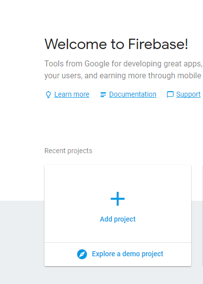
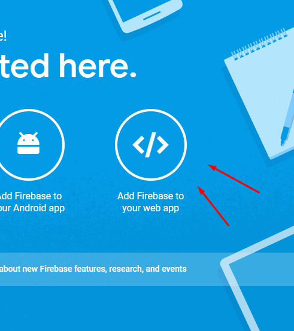
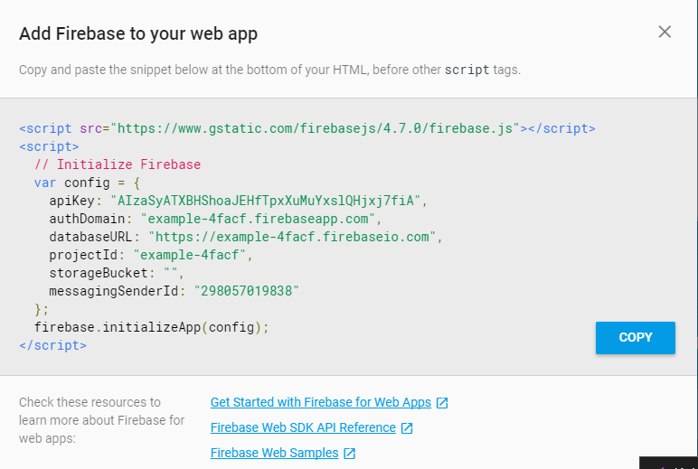

# CHATBACK BACKOFFICE #

A basic back office SPA for the [rebelchat-script](https://github.com/rebelstackio/rebelchat-script)


## REQUIREMENTS ##
```

"Requirements"

In order to run this project you will need:

nodejs
npm
yarn
git
a text editor
a firebase project

You can install these dependencies on Ubuntu from the official repository by running:

sudo apt-get update

sudo apt-get install nodejs

sudo apt-get install npm

npm install -g yarn

sudo apt-get install git

git config --global user.name "Sample Name"
git config --global user.email "email@example.com"

If you are using windows or mac you could install the requirements from their official websites,
download the setup and follow the instructions:

npm & nodejs: https://nodejs.org/en/download/
yarn: https://yarnpkg.com/en/docs/install
git: https://git-scm.com/downloads

```

## INSTALLATION ##

### STEP 1 ###
```
Create a firebase project on:

https://console.firebase.google.com/
```

### screenshot 1 ###


### STEP 2 ###

```
Get the required project information in the firebase console by clicking on "Add Firebase to your web app"
```



```
The information obtained on this step will be used on step 5.
```
### STEP 3 ###
```
Clone the repository by opening a terminal and running:

git clone https://github.com/rebelstackio/rebelchat-backoffice.git
```
### STEP 4 ###
```
After cloning the repo run:

cd rebelchat-backoffice

and then:

yarn install
```
### STEP 5 ###
```

After yarn has installed all dependencies do the following:

create file ".env" inside the project's root directory, replace sample values with the values obtained on step 2:

NODE_ENV=development
APIKEY=SAMPLE_FIREBASE_APIKEY
AUTHDOMAIN=sampledomain.firebaseapp.com
DATABASEURL=https://sampledatabaseurl.firebaseio.com
STORAGEBUCKET=samplestoragebucket.appspot.com
COMPANY_NAME=FAKE
MESSAGING_SENDER_ID=samplesenderid

"You can get this values from the firebase console settings"

```
### STEP 6 ###
```

Finally run:

npm start

If all was done correctly a demo server will run on:

http://localhost:9000

serving the rebelchat backoffice

```
